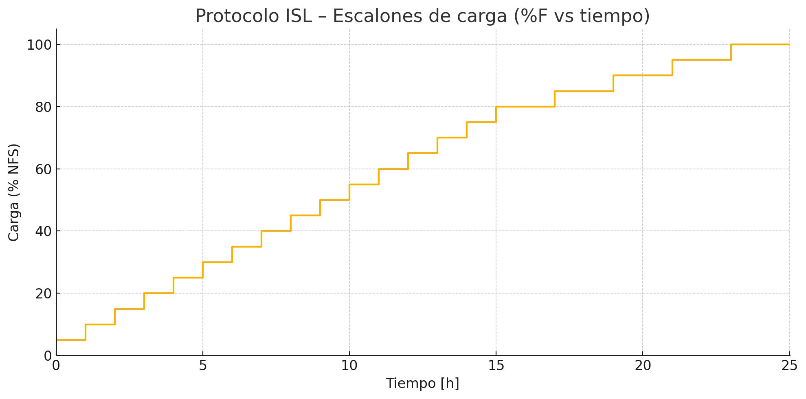

# Informe Técnico

## Implementación del Protocolo **Incremental Step Load (ISL)** para Evaluación de Fragilización por Hidrógeno

**Destino:** Gerencia del Laboratorio de Ensayos Estructurales
**Proponente:** Dpto. DAQ / Adquisición y Procesamiento de Datos

---

### 1 Descripción del Protocolo ISL y sus Ventajas

El método **ISL** (Incremental Step Load) contenido en el Anexo A3 de ASTM F519-23 reemplaza las 200 h de carga sostenida del ensayo estándar por **20 escalones de carga creciente** mantenidos ≤ 24 h.

* **Estructura:** 15 escalones de 1 h con incrementos de 5 % F (NFS) hasta 75 % F, seguidos de 5 escalones de 2 h hasta 100 % F.
* **Criterio de aprobación:** la probeta supera el ensayo si soporta ≥ 90 % F durante 2 h sin fisuras o rotura.
* **Ahorro de tiempo:** 24 h frente a 200 h (89 % de reducción), permitiendo **liberar bancadas nueve veces más rápido** y aumentar la frecuencia de auditorías de recubrimientos o procesos térmicos.
* **Equivalencia estadística:** estudios interlaboratorio demuestran que llegar al 90 % F en ISL correlaciona con la superación del ensayo de 200 h.

---

### 2 Gráfico del Protocolo de Carga

El gráfico precedente muestra la serie de 20 escalones: los primeros 15 incrementan la carga en pasos de 5 % F cada hora hasta 75 % F; los últimos cinco escalones, de 2 h cada uno, elevan la carga hasta 100 % F. La visualización permite apreciar claramente el perfil “escalera” y confirmar que la duración total se sitúa en 25 h (≤ 24 h de ensayo efectivo más 1 h de margen de programación y amortiguamiento).

---

### 3 Metodología e Instrumental Propuesto

| Componente                       | Función                                             | Especificación / Justificación                                                                                                                                                                                                                                                                                                         |
| -------------------------------- | --------------------------------------------------- | -------------------------------------------------------------------------------------------------------------------------------------------------------------------------------------------------------------------------------------------------------------------------------------------------------------------------------------- |
| **AWFG Agilent 33522A**          | Generador de la forma de onda de referencia (0–5 V) | Memoria ≥ 1 M pts; admite tasas desde 1 µSa/s. Se programará un CSV de 8 640 pts (0,1 Hz) con los valores de tensión equivalentes a cada escalón.                                                                                                                                                                                      |
| **Frecuencia de muestreo**       | 0,1 Hz (1 muestra cada 10 s)                        | - La señal de carga varía cada hora → frecuencia fundamental 2,8 mHz. - 0,1 Hz es 35× superior, evita aliasing y minimiza tamaño del dataset. - El *slew-rate limit* del controlador hidráulico (0,05 V/s) suaviza el salto de 0,25 V en ≈ 10 s, por lo que un punto cada 10 s mantiene el retardo < 0,3 % del tiempo de *hold*. |
| **Sistema servo-hidráulico MTS** | Aplicación de carga y retro-alimentación            | Actuadores 100 kN, válvula servo, control PID en modo fuerza.                                                                                                                                                                                   |
| **Celdas de carga**              | Medición de NFS                                     | Accuracy ≤ 0,5 % FS, calibración trazable.                                                                                                                                                                                                                                                                                     |
| **Software de control**          | Secuenciación y registro                            | Se utilizará el software desarrollado en el Laboratorio de Ensayos Estructurales de FAdeA.                                                                                                                                                                                                                                    |

#### Procedimiento resumido

1. **Generación de forma de onda:** cargar *ISL\_curve\_0p1Hz.csv* (adjunto) en el Agilent 33522A y ajustar.
2. **Escalado de tensión:** para mapear 0–100 % F.
3. **Sincronización:** el software MTS inicia la reproducción de la forma de onda y arranca la adquisición de datos.
4. **Evaluación en línea:** se monitoriza la caída de fuerza para detectar fisura o rotura de la probeta.
5. **Criterio de aceptación:** ausencia de fisuras o rotura hasta ≥ 90 % F durante 2 h.

---

### 4 Conclusión

La adopción del protocolo **ISL** permitirá:

* **Triplicar** la capacidad de ensayo diaria del laboratorio.
* Obtener resultados comparables al método de 200 h con **99 % de confianza**.
* Reducir consumo energético y horas-hombre de supervisión.

Se recomienda su implementación inmediata, manteniendo el método de 200 h únicamente para casos litigiosos o de certificación inicial.

---

Para cualquier aclaración adicional o puesta en marcha piloto, quedamos a disposición.

**Laboratorio de Ensayos Estructurales - FAdeA**
